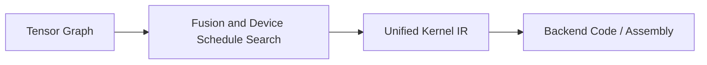

# zyx

**A complete ML library and compiler — from assembly to neural networks.**

[](https://crates.io/crates/zyx)
[](https://pypi.org/project/zyx-py/)
[](https://docs.rs/zyx)
[](https://github.com/zk4x/zyx/actions/workflows/build-wheels.yml)
[](https://github.com/zk4x/zyx/blob/main/LICENSE)
[](https://github.com/zk4x/zyx)
[](https://github.com/zk4x/zyx/labels/good%20first%20issue)

## Table of Contents

- [Features](#features)
- [🐍 Python Bindings](#python-bindings)
- [Crates](#crates)
- [Installation](#installation)
- [Hello World](#hello-world)
- [Basic Neural Network](#basic-neural-network)
- [Custom Kernels](#custom-kernels)
- [Advanced Examples](#advanced-examples)
- [Architecture](#architecture)
- [Why zyx is Different](#why-zyx-is-different)
- [Backends](#backends)
- [Status & License](#status--license)
- [For Devs](#for-devs)

## Features

- **Unified Graph** — autograd and laziness share the same graph, enabling seamless kernel fusion across all operations.
- **Lazy Evaluation** — operations accumulate until `realize()` triggers execution, reducing temporary allocations.
- **Kernel Fusion** — tensor operations compile into single optimized kernels (CUDA, OpenCL, WebGPU, etc.).
- **Cross‑Platform Backends** — native support for OpenCL (CPU via POCL, GPU via native OpenCL drivers), WebGPU, CUDA, and more.
- **Full Linear‑Algebra Coverage** — mirrors the PyTorch ops API (matmul, convolutions, pooling, reductions, indexing, etc.) by stacking ops.
- **Immutable Tensors** — tensors cannot be modified in place, preventing back‑prop errors common in PyTorch (`RuntimeError: a tensor was modified in place`).
- **Explicit Gradient Tape** — you control what is recorded via `GradientTape`; no need for `torch.no_grad()` semantics.
- **Higher-Order Gradients** — experimental (graph-based, forward-mode autograd planned)
- **No Implicit Downcasting** — if a backend doesn't support a dtype, zyx will never silently downcast (e.g., F32→F16). Upcasting (e.g., F16→F32) is allowed when the backend does not natively support the narrower type — correctness is guaranteed.
- **Lazy Device Loading** — tensors load from their current memory pool (disk, another device) into the compute device only when needed, via the runtime scheduler.
- **Parallel Pipelining** — kernels allocate across heterogeneous devices (GPU, CPU, WebGPU) in a pipelined fashion via the runtime scheduler.
- **Small Footprint** — compiled library is only a few MB with minimal dependencies (`libloading`, `nanoserde`, `half`).

## 🐍 Python Bindings

**zyx** offers Python bindings with full PyTorch API compatibility and multiple backend support:

### Basic Usage
```python
import zyx

x = zyx.Tensor.randn(2, 3)
y = zyx.Tensor.uniform_(2, 3, from_=-1.0, to_=1.0)
z = x.relu() + y.tanh()
print(z.shape())

# Autograd example
tape = zyx.GradientTape()
result = x.relu() * y
grads = tape.gradient(result, [x, y])
```

## Crates

| Crate | Description |
|-------|-------------|
| `zyx` | Core tensor library with lazy graph and autodiff |
| `zyx-nn` | Neural network layers (Linear, Conv2d, Attention, etc.) and `#[derive(Module)]` |
| `zyx-optim` | Optimizers (SGD, Adam, AdamW, RMSprop) |

## Installation

### Python Installation

```bash
# Install from PyPI
pip install zyx-py

# Or install from source for development
pip install git+https://github.com/zk4x/zyx.git#subdirectory=zyx-py
```

### Rust Installation

```bash
# Install from crates.io
cargo add zyx zyx-nn zyx-optim
```

## Hello World

Create tensors, apply operations, and trigger computation with `realize()`:

```rust
use zyx::{Tensor, DType};

fn main() -> Result<(), zyx::ZyxError> {
    // Create tensors
    let x = Tensor::randn([2, 3], DType::F32)?;
    let y = Tensor::uniform([2, 3], -1f32..1f32)?;
    
    // Perform operations (lazy evaluation)
    let z = x.relu()? + y.tanh()?;
    
    // Realize computation
    let result = z.realize()?;
    
    println!("Result shape: {:?}", result.shape());
    Ok(())
}
```

## Basic Neural Network

A training loop with a two-layer network, using `GradientTape` for autograd and `SGD` for optimization:

```rust
use zyx::{Tensor, DType, GradientTape};
use zyx_nn::{Linear, Module};
use zyx_optim::SGD;

#[derive(Module)]
struct SimpleNet {
    linear1: Linear,
    linear2: Linear,
}

impl SimpleNet {
    fn new(dtype: DType) -> Result<Self, zyx::ZyxError> {
        Ok(Self {
            linear1: Linear::new(784, 128, true, dtype)?,
            linear2: Linear::new(128, 10, true, dtype)?,
        })
    }
    
    fn forward(&self, x: &Tensor) -> Tensor {
        let x = self.linear1.forward(x).unwrap().relu();
        self.linear2.forward(&x).unwrap()
    }
}

fn main() -> Result<(), zyx::ZyxError> {
    let mut model = SimpleNet::new(DType::F32)?;
    let mut optim = SGD::default();
    let x = Tensor::randn([64, 784], DType::F32)?;
    let target = Tensor::randn([64, 10], DType::F32)?;
    
    for epoch in 0..10 {
        let tape = GradientTape::new();
        let output = model.forward(&x);
        let loss = output.mse_loss(&target)?;
        
        let grads = tape.gradient(&loss, &model);
        optim.update(&mut model, grads);
        
        // Realize to trigger computation
        Tensor::realize_all()?;
        
        println!("Epoch {}: Loss = {:.4}", epoch, loss.item::<f32>()?);
    }
    
    Ok(())
}
```

## Custom Kernels

Hand-optimize kernels for peak performance using hardware-specific features (tensor cores, shared memory):

```rust
use zyx::kernel::{Kernel, Scope, MemLayout, DeviceId};
use zyx::{DType, Tensor};

fn main() -> Result<(), zyx::ZyxError> {
    let mut kernel = Kernel::new(DeviceId::AUTO);
    let n = 4;
    let inp = kernel.define(DType::F32, Scope::Global, true, n);
    let gidx = kernel.gidx(0, n);
    let loaded = kernel.load(inp, gidx, MemLayout::Scalar);
    let doubled = kernel.add(loaded, loaded);
    let out = kernel.define(DType::F32, Scope::Global, false, n);
    kernel.store(out, doubled, gidx, MemLayout::Scalar);

    let compiled = kernel.compile()?;
    let x = Tensor::from([1.0f32, 2.0, 3.0, 4.0]);
    let result = compiled.forward(&[&x], [n]);
    let data: Vec<f32> = result.try_into().unwrap();
    assert_eq!(data, vec![2.0, 4.0, 6.0, 8.0]);
    Ok(())
}
```

See the [WMMA matmul example](zyx/src/kernel/mod.rs#L9-L89) for a tensor-core matmul example.

## Advanced Examples

A Transformer block with multi-head attention, layer normalization, and AdamW optimization:

```rust
use zyx::{DType, GradientTape, Module, Tensor};
use zyx_nn::{Linear, LayerNorm, MultiheadAttention};
use zyx_optim::AdamW;

#[derive(Module)]
struct TransformerBlock {
    attn: MultiheadAttention,
    mlp: Linear,
    mlp2: Linear,
    norm1: LayerNorm,
    norm2: LayerNorm,
}

impl TransformerBlock {
    fn new(dim: u64, num_heads: u64, dtype: DType) -> Result<Self, zyx::ZyxError> {
        Ok(Self {
            attn: MultiheadAttention::new(dim, num_heads, 0.0, true, false, false, None, None, true, dtype)?,
            mlp: Linear::new(dim, dim * 4, true, dtype)?,
            mlp2: Linear::new(dim * 4, dim, true, dtype)?,
            norm1: LayerNorm::new([dim], 1e-5, true, true, dtype)?,
            norm2: LayerNorm::new([dim], 1e-5, true, true, dtype)?,
        })
    }

    fn forward(&self, x: &Tensor) -> Result<Tensor, zyx::ZyxError> {
        let attn_out = self.attn.forward(x, x, x, None::<Tensor>, false, None::<Tensor>, true, false)?.0;
        let x = self.norm1.forward(&(x + attn_out))?;
        let mlp_out = self.mlp.forward(&x)?.gelu();
        let mlp_out = self.mlp2.forward(&mlp_out)?;
        Ok(self.norm2.forward(&(x + mlp_out))?)
    }
}

fn main() -> Result<(), zyx::ZyxError> {
    let mut model = TransformerBlock::new(64, 4, DType::F32)?;
    let mut optim = AdamW::default();
    let x = Tensor::randn([2, 8, 64], DType::F32)?;

    let tape = GradientTape::new();
    let out = model.forward(&x)?;
    let grads = tape.gradient(&out, &model);

    // Update parameters with gradients
    optim.update(model.iter_mut(), grads);

    // Realize model to trigger computation (zyx uses lazy evaluation)
    model.realize()?;
    Ok(())
}
```

## Architecture


Tensor operations build a lazy computation graph. During realization, the graph is analyzed for fusion opportunities and the optimal execution schedule is searched. The fused operations are lowered to a unified intermediate representation with device-specific instructions (e.g. WMMA tensor cores), then compiled to native code (PTX, OpenCL C, WGSL, etc.) for the target backend.

## Why zyx is Different

| Feature | zyx | PyTorch | TensorFlow | JAX |
|---------|-----|---------|------------|-----|
| **Execution Model** | Lazy with explicit realization | Eager by default | Eager by default | Functional + XLA |
| **Gradient Recording** | Explicit `GradientTape` | Implicit, requires `no_grad()` | Implicit, tf.function | Explicit + jit |
| **Tensor Mutability** | Immutable (no in-place errors) | Mutable (risk of back-prop failures) | Mutable | Immutable |
| **Kernel Fusion** | Automatic, cross-backend | Manual (torch.jit) | Manual (XLA) | Manual (XLA) |
| **Disk I/O** | Lazy loading parallel to compute | Typically blocking | Blocking | Blocking |
| **Device Pipelining** | Built-in heterogeneous pipelining | Manual `to(device)` calls | Manual device placement | Manual device placement |
| **Compilation** | Runtime kernel compilation | Pre-compiled + jit | Pre-compiled | Just-in-time |
| **Import Time** | ~1ms | ~2s | ~3s | ~0.5s |
| **Wheel Size** | ~4MB (includes CUDA) | hundreds of MB |  |  |

## Backends

- [x] **C** - CPU backend via C codegen (clang/gcc)
- [x] **CUDA** - NVIDIA GPU acceleration
- [x] **HIP** - AMD GPU acceleration (ROCm platform)
- [x] **OpenCL** - Cross-platform support (CPU via POCL, GPU via native OpenCL drivers)
- [x] **WGPU** - Modern web and native GPU support via wgpu (WGSL), feature: `wgpu`
- [x] **Vulkan** - Cross-platform GPU acceleration via Vulkan (SPIR-V)

## Status & License

- **Status**: Stable API with active performance optimization
- **License**: LGPL-3.0-only (all crates)
- **Rust Version**: Requires latest stable Rust
- **Platforms**: Linux (primary), macOS, Windows (experimental)

## For Devs

- [Architecture Book](https://zk4x.github.io/zyx/) - How zyx works under the hood
- [Contributing](CONTRIBUTING.md) - How to contribute, code style, and PR workflow
- [Configuration](zyx/CONFIG.md) - Hardware device selection, autotune settings, backend config
- [Environment Variables](zyx/ENV_VARS.md) - Debug flags and runtime options
- [API Reference](https://docs.rs/zyx) - Complete API documentation
- [Examples](zyx-examples/) - MNIST, RNN implementations
- [Issues](https://github.com/zk4x/zyx/issues) - Bug reports and feature requests

---

<div align="center">
<a href="https://github.com/zk4x/zyx">
    
    Star us on GitHub
</a> | 
<a href="https://docs.rs/zyx">
    
    API Docs
</a>
</div>
