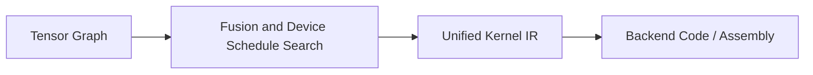

# zyx

**ML library for your hardware**

[](https://crates.io/crates/zyx)
[](https://pypi.org/project/zyx-py/)
[](https://docs.rs/zyx)
[](https://github.com/zk4x/zyx/actions/workflows/build-wheels.yml)
[](https://github.com/zk4x/zyx/blob/main/LICENSE)
[](https://github.com/zk4x/zyx)
[](https://github.com/zk4x/zyx/labels/good%20first%20issue)

## Table of Contents

- [Features](#features)
- [🐍 Python Bindings](#python-bindings)
- [Crates](#crates)
- [Installation](#installation)
- [Hello World](#hello-world)
- [Basic Neural Network](#basic-neural-network)
- [Custom Kernels](#custom-kernels)
- [Advanced Examples](#advanced-examples)
- [Architecture](#architecture)
- [Why zyx is Different](#why-zyx-is-different)
- [Backends](#backends)
- [Status & License](#status--license)
- [For Devs](#for-devs)

## TLDR

- **Eager-ish Execution** — tensor operations fuse into kernels as you write them; when fusion is no longer possible, the kernel executes. For one off computations.
- **Tape Mode** — wrap loops in a `Tape` for lazy graph building, autograd and egraph-based fusion optimization. For repeated computations.
- **Cross‑Platform Backends** — native codegen for C, CUDA, OpenCL and SPIR-V.
- **Full Linear‑Algebra Coverage** — mirrors the PyTorch ops API (matmul, convolutions, pooling, reductions, indexing, etc.) by stacking ops. Stack more ops yourself to get more op coverage, zyx auto fuses and optimizes it.
- **Immutable Tensors** — tensors cannot be modified in place, preventing back‑prop errors common in PyTorch (`RuntimeError: a tensor was modified in place`).
- **Explicit Tape** — you control what is recorded via `Tape`; no need for `torch.no_grad()` or requires_grad semantics.
- **Everything is diff** — every tensor in tape can be differentiated w.r.t. any other tensor in tape.
- **Lazy Device Loading** — tensors load from their current memory pool (disk, another device) into the compute device only when needed.
- **Parallel Pipelining** — kernels allocate across heterogeneous devices (GPU, CPU, WebGPU) in a pipelined fashion via the scheduler automatcially. e-graph tries all options, picks the fastest measured path.
- **Small Footprint** — compiled library is only a few MB with two dependencies (`libloading`, `nanoserde`) and std. This means for all models, a few MB binary runs (and trains) them on all backends. Training and deployment can freely use the same API.

## 🐍 Python Bindings

zyx has Python bindings:

### Basic Usage
```python
import zyx

x = zyx.Tensor.randn(2, 3)
y = zyx.Tensor.uniform_(2, 3, from_=-1.0, to_=1.0)
z = x.relu() + y.tanh()
print(z.shape())

# Autograd example with tape
tape = zyx.Tape()
result = x.relu() * y
grads = tape.gradient(result, [x, y])
```

## Crates

| Crate | Description |
|-------|-------------|
| `zyx` | Core tensor library with eager-ish fusion and tape-based autodiff |
| `zyx-nn` | Neural network layers (Linear, Conv2d, Attention, etc.) and `#[derive(Module)]` |
| `zyx-optim` | Optimizers (SGD, Adam, AdamW, RMSprop) |

## Installation

### Python Installation

```bash
# Install from PyPI
pip install zyx-py

# Or install from source for development
pip install git+https://github.com/zk4x/zyx.git#subdirectory=zyx-py
```

### Rust Installation

```bash
# Install from crates.io
cargo add zyx zyx-nn zyx-optim
```

## Neural Nets

A training loop with a two-layer network, using `Tape` for autograd and graph caching:

```rust
use zyx::{Tensor, DType, Tape};
use zyx_nn::{Linear, Module};
use zyx_optim::SGD;

#[derive(Module)]
struct SimpleNet {
    linear1: Linear,
    linear2: Linear,
}

impl SimpleNet {
    fn new(dtype: DType) -> Result<Self, zyx::ZyxError> {
        Ok(Self {
            linear1: Linear::new(784, 128, true, dtype)?,
            linear2: Linear::new(128, 10, true, dtype)?,
        })
    }
    
    fn forward(&self, x: &Tensor) -> Tensor {
        let x = self.linear1.forward(x).unwrap().relu();
        self.linear2.forward(&x).unwrap()
    }
}

fn main() -> Result<(), zyx::ZyxError> {
    let mut model = SimpleNet::new(DType::F32)?;
    let mut optim = SGD::default();
    let x = Tensor::randn([64, 784], DType::F32)?;
    let target = Tensor::randn([64, 10], DType::F32)?;
    
    for epoch in 0..10 {
        let tape = Tape::new(&model)?;
        let output = model.forward(&x);
        let loss = output.mse_loss(&target)?;
        let grads = tape.gradient(&loss, &model);
        optim.update(&mut model, grads);
        tape.realize(&model)?;
    }
    
    Ok(())
}
```

## Custom Kernels

Hand-optimize kernels for peak performance using hardware-specific features (e.g. tensor cores):

```rust
use zyx::kernel::{Kernel, Scope, MemLayout, DeviceId};
use zyx::{DType, Tensor};

fn main() -> Result<(), zyx::ZyxError> {
    let mut kernel = Kernel::new(DeviceId::AUTO);
    let n = 4;
    let inp = kernel.define(DType::F32, Scope::Global, true, n);
    let gidx = kernel.gidx(0, n);
    let loaded = kernel.load(inp, gidx, MemLayout::Scalar);
    let doubled = kernel.add(loaded, loaded);
    let out = kernel.define(DType::F32, Scope::Global, false, n);
    kernel.store(out, doubled, gidx, MemLayout::Scalar);

    let compiled = kernel.compile()?;
    let x = Tensor::from([1.0f32, 2.0, 3.0, 4.0]);
    let result = compiled.forward(&[&x], [n]);
    let data: Vec<f32> = result.try_into().unwrap();
    assert_eq!(data, vec![2.0, 4.0, 6.0, 8.0]);
    Ok(())
}
```

See the [WMMA matmul example](zyx/src/kernel/mod.rs#L9-L89) for a tensor-core matmul example.

## Architecture


```mermaid
flowchart LR
    A["Tensor Graph"] --> B["Fusion and Device Schedule Search"]
    B --> C["Unified Kernel IR"]
    C --> D["Backend Code / Assembly"]
```
Outside a tape, tensor operations fuse eagerly into kernels as you call them.
Inside a tape, a lazy graph is built and analyzed for fusion opportunities during
realization. The fused operations are lowered to a unified
intermediate representation, then compiled to native code (PTX, OpenCL C, WGSL, etc.)
for the target backend. Tape egraph compares fusion schemes and device allocations.

## Why zyx is Different

| Feature | zyx | PyTorch | TensorFlow | JAX |
|---------|-----|---------|------------|-----|
| **Execution Model** | Eager-ish fusion (default) + Tape (lazy + autograd) | Eager by default | Eager by default | Functional + XLA |
| **Gradient Recording** | Explicit `Tape` | Implicit, requires `no_grad()` | Implicit, tf.function | Explicit + jit |
| **Tensor Mutability** | Immutable (no in-place errors) | Mutable (risk of back-prop failures) | Mutable | Immutable |
| **Kernel Fusion** | Automatic, all backends | Manual (torch.jit) | Manual (XLA) | Manual (XLA) |
| **Disk I/O** | Lazy loading parallel to compute | Typically blocking | Blocking | Blocking |
| **Device Pipelining** | Built-in heterogeneous pipelining | Manual `to(device)` calls | Manual device placement | Manual device placement |
| **Compilation** | Just-in-time | Pre-compiled + jit | Pre-compiled | Just-in-time |
| **Import Time** | ~1ms | ~2s | ~3s | ~0.5s |
| **Wheel Size** | ~5MB (includes all backends) | hundreds of MB |

## Backends

- [x] **C** - C codegen (clang/gcc)
- [x] **CUDA**
- [x] **HIP** - ROCm
- [x] **OpenCL**
- [x] **Vulkan** - SPIR-V codegen
- [x] **WGPU** - SPIR-V codegen, feature: `wgpu`

## Status & License

- **Status**: Stable API with active performance optimization
- **License**: LGPL-3.0-only (all crates)
- **Rust Version**: Requires latest stable Rust
- **Platforms**: Linux (primary), macOS, Windows (experimental)

## For Devs

- [Architecture Book](https://zk4x.github.io/zyx/) - How zyx works under the hood
- [Contributing](CONTRIBUTING.md) - How to contribute, code style, and PR workflow
- [Configuration](zyx/CONFIG.md) - Hardware device selection, autotune settings, backend config
- [Environment Variables](zyx/ENV_VARS.md) - Debug flags and runtime options
- [API Reference](https://docs.rs/zyx) - Complete API documentation
- [Examples](zyx-examples/) - MNIST, RNN implementations
- [Issues](https://github.com/zk4x/zyx/issues) - Bug reports and feature requests

---

<div align="center">
<a href="https://github.com/zk4x/zyx">
    
    Star us on GitHub
</a> | 
<a href="https://docs.rs/zyx">
    
    API Docs
</a>
</div>
