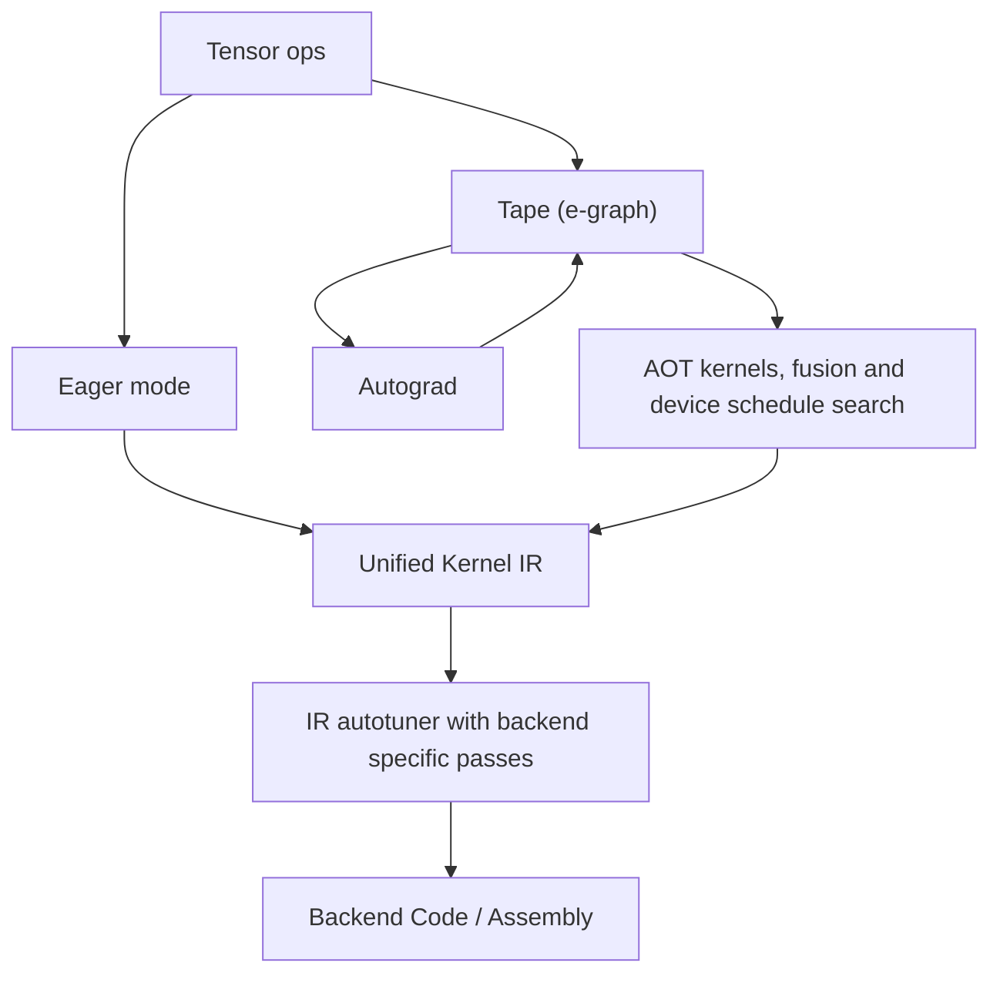

# zyx

**ML library for your hardware**

[](https://crates.io/crates/zyx)
[](https://pypi.org/project/zyx-py/)
[](https://docs.rs/zyx)
[](https://github.com/zk4x/zyx/actions/workflows/build-wheels.yml)
[](https://github.com/zk4x/zyx/blob/main/LICENSE)
[](https://github.com/zk4x/zyx)


# Why?

ML was enabled by new kinds of highly parallel, high performance hardware that did not exist before.

Zyx has 3 goals:
1. Be correct
2. Run everywhere (all hardware)
3. Run fast

And also be nice to use while at that.

ML won't get better without new hardware and existing libraries are ill-suited to support emerging hardware.
The primary problem is the requirement to write custom kernels to get the required performance.
Manufactures have tough time writing these high performance kernels, therefore they write kernels for only
a few ops and don't support general linear algebra.

Zyx approaches these problems from two angles, while maintaining high flexibility (proven by several relatively fast
rewrites of core components without significant API changes, to accomodate more hardware):

### 1. Supporting all ops

Zyx has linear SSA-ish IR with explicit control flow. This is the hardware unifying interface. Each hardware has
add instructions, can repeat instructions (loop), is highly parallel (work sizes), has multiple types of memory
in a hierarchy (or at least global and registers) and can optionally have vectorization and tiling.
This is the core of the instruction set. Zyx has a series of optimization passes (selected by autotuner)
that apply various optimizations for different levels of these characteristics. The lowering layer from IR
to backends is almost 1:1 mapping. If your hardware can provide this translation, zyx gives you all of linear
algebra support.

### 2. Bringing top performance

As good as the automatic optimizations can be, writing manual kernels will always be faster, that is why
it is the dominant approach as of now. Zyx acknowledges this and maintains flexibility through it's egraph
system pattern matching of any subgraph structure into a custom kernel written in language of your choosing
(or raw binary blobs, cublas, cblas, etc.), as well as writing custom kernels in zyx IR and taking advantage
of optimization passes zyx provides. Egraph measures their timings, compares with auto-generated zyx kernels
and picks the fastest path through this graph.

The other issue is running on edge and platforms that don't have sufficient resources. A regular CPU only
pytorch install is 100+ MB, while with cuda support, it's 2+ GB. Zyx takes only about 5 MB and uses machine
available drivers to run, such as provided C compiler, provided CUDA runtime, but for example if you don't install
CUDA, any gpu driver with vulkan support is sufficient.


## Features

- **Eager-ish Execution** — tensor operations fuse into kernels as you write them; when fusion is no longer possible, the kernel executes. For one off computations.
- **Tape Mode** — wrap loop bodies in a `Tape` for lazy graph building, autograd and egraph-based fusion optimization. For repeated computations.
- **Cross‑Platform Backends** — codegen for C, CUDA, OpenCL and SPIR-V.
- **Full Linear‑Algebra Coverage** — mirrors the PyTorch ops API (matmul, convolutions, pooling, reductions, indexing, etc.) by stacking ops. Stack more ops yourself to get more op coverage, zyx auto fuses and optimizes it.
- **Immutable Tensors** — tensors cannot be modified in place, preventing back‑prop errors common in PyTorch (`RuntimeError: a tensor was modified in place`).
- **Explicit Tape** — you control what is recorded via `Tape`; no need for `torch.no_grad()` or requires_grad semantics.
- **Everything is diff** — every tensor in tape can be differentiated w.r.t. any other tensor in tape.
- **Lazy Device Loading** — tensors load from their current memory pool (disk, another device) into the compute device only when needed.
- **Parallel Pipelining** — kernels allocate across heterogeneous devices (GPU, CPU, WebGPU) in a pipelined fashion via the scheduler automatcially. e-graph tries all options, picks the fastest measured path.
- **Small Footprint** — compiled library is only a few MB with two dependencies (`libloading`, `nanoserde`) and std. This means for all models, a few MB binary runs (and trains) them on all backends. Training and deployment can freely use the same API.


## Crates

| Crate | Description |
|-------|-------------|
| `zyx` | Core tensor library with eager-ish fusion and tape-based autodiff |
| `zyx-nn` | Neural network layers (Linear, Conv2d, Attention, etc.) and `#[derive(Module)]` |
| `zyx-optim` | Optimizers (SGD, Adam, AdamW, RMSprop) |


## Installation

```bash
# from crates.io
cargo add zyx zyx-nn zyx-optim

# from PyPI, contains all backends, nn and optim
pip install zyx-py
```


## Configuration & Debugging

- [Configuration](CONFIG.md) - Hardware device selection, autotune settings
- [Environment Variables](ENV_VARS.md) - Debug flags


## 🐍 Python Bindings

```python
import zyx

x = zyx.Tensor.randn(2, 3)
y = zyx.Tensor.uniform_(2, 3, from_=-1.0, to_=1.0)
z = x.relu() + y.tanh()
print(z.shape())

# Autograd with tape
tape = zyx.Tape([x, y])
result = x.gelu() * y
grads = tape.gradient(result, [x, y])
```


## Neural Nets

A training loop with a two-layer network, using `Tape` for autograd and optimizations:

```rust
use zyx::{Tensor, DType, Tape};
use zyx_nn::{Linear, Module};
use zyx_optim::SGD;

#[derive(Module)]
struct SimpleNet {
    linear1: Linear,
    linear2: Linear,
}

impl SimpleNet {
    fn new(dtype: DType) -> Result<Self, zyx::ZyxError> {
        Ok(Self {
            linear1: Linear::new(784, 128, true, dtype)?,
            linear2: Linear::new(128, 10, true, dtype)?,
        })
    }
    
    fn forward(&self, x: &Tensor) -> Tensor {
        let x = self.linear1.forward(x).unwrap().relu();
        self.linear2.forward(&x).unwrap()
    }
}

fn main() -> Result<(), zyx::ZyxError> {
    let mut model = SimpleNet::new(DType::F32)?;
    let mut optim = SGD::default();
    let x = Tensor::randn([64, 784], DType::F32)?;
    let target = Tensor::randn([64, 10], DType::F32)?;
    
    for epoch in 0..100 {
        let tape = Tape::new(&model)?;
        let output = model.forward(&x);
        let loss = output.mse_loss(&target)?;
        let grads = tape.gradient(&loss, &model);
        optim.update(&mut model, grads);
        tape.realize(&model)?;
    }
    
    Ok(())
}
```

For more complex examples:
- [Examples](zyx-examples/) - MNIST, RNN and others


## Custom Kernels

Hand-optimize kernels for peak performance using hardware-specific features (e.g. tensor cores) using zyx IR:

```rust
use zyx::kernel::{Kernel, Scope, MemLayout, DeviceId};
use zyx::{DType, Tensor};

fn main() -> Result<(), zyx::ZyxError> {
    let mut kernel = Kernel::new(DeviceId::AUTO);
    let n = 4;
    let inp = kernel.define(DType::F32, Scope::Global, true, n);
    let gidx = kernel.gidx(0, n);
    let loaded = kernel.load(inp, gidx, MemLayout::Scalar);
    let doubled = kernel.add(loaded, loaded);
    let out = kernel.define(DType::F32, Scope::Global, false, n);
    kernel.store(out, doubled, gidx, MemLayout::Scalar);

    let compiled = kernel.compile()?;
    let x = Tensor::from([1.0f32, 2.0, 3.0, 4.0]);
    let result = compiled.forward(&[&x], [n]);
    let data: Vec<f32> = result.try_into().unwrap();
    assert_eq!(data, vec![2.0, 4.0, 6.0, 8.0]);
    Ok(())
}
```

See the [WMMA matmul example](zyx/src/kernel/mod.rs#L9-L89) for a tensor-core matmul example.


## Architecture


```mermaid
graph TD
    A["Tensor ops"] --> B["Eager mode"]
    A --> C["Tape (e-graph)"]
    C --> D["Autograd"]
    D --> C
    C --> E["AOT kernels, fusion and device schedule search"]
    B --> F["Unified Kernel IR"]
    E --> F
    F --> G["IR autotuner with backend specific passes"]
    G --> H["Backend Code / Assembly"]
```

Outside the tape, tensor operations fuse eagerly into kernels as you call them using unified kernel IR.
Inside a tape, a lazy graph is built and analyzed for fusion opportunities during realization
or may pattern match parts of graph into AOT kernels. Differe device allocations are also compared.
The fused operations are lowered to a unified kernel IR. Kernel IR is then autotuned and compiled
to native code for the target backend.


## Why zyx is Different

| Feature | zyx | PyTorch | TensorFlow | JAX |
|---------|-----|---------|------------|-----|
| **Execution Model** | Eager-ish fusion (default) + Tape (lazy + autograd) | Eager by default | Eager by default | Functional + XLA |
| **Gradient Recording** | Explicit `Tape` | Implicit, requires `no_grad()` | Implicit, tf.function | Explicit + jit |
| **Tensor Mutability** | Immutable | Mutable (risk of back-prop failures) | Mutable | Immutable |
| **Kernel Fusion** | Automatic, all backends | Manual (torch.jit) | Manual (XLA) | Manual (XLA) |
| **Disk I/O** | Lazy loading parallel to compute | Typically blocking | Blocking | Blocking |
| **Device Pipelining** | Built-in heterogeneous pipelining | Manual `to(device)` calls | Manual device placement | Manual device placement |
| **Compilation** | Just-in-time | Pre-compiled + jit | Pre-compiled | Just-in-time |
| **Import Time** | ~1ms | ~2s | ~3s | ~0.5s |
| **Wheel Size** | ~5MB (includes all backends) | hundreds of MB |


## Backends

- [x] **C** - C codegen (clang/gcc)
- [x] **CUDA**
- [x] **OpenCL**
- [x] **Vulkan** - SPIR-V codegen
- [x] **WGPU** - SPIR-V codegen, feature: `wgpu`
- [ ] `tenstorrent` - Preliminary support, does not pass full test suite yet, feature `tenstorrent`

If you'd like to add new backend to zyx, that would be awesome!
Please read [ADDING_BACKENDS.md](https://github.com/zk4x/zyx/blob/main/ADDING_BACKENDS.md)


## Roadmap

- [ ] full tenstorrent coverage
- [ ] pattern matching for e-graph AOT kernels
- [ ] custom backend code/assembly kernels
- [ ] more benchmarks + more model examples


## Status & License

- **Status**: Stable API with active performance optimization
- **License**: LGPL-3.0-only (all crates)
- **Rust Version**: stable rust >= 1.88.0
- **Platforms**: Linux (primary), macOS, Windows (planned)


## For Devs

- [Architecture Book](https://zk4x.github.io/zyx/) - How zyx works under the hood
- [Contributing](CONTRIBUTING.md) - How to contribute
- [Adding backends](ADDING_BACKENDS.md) - How to add new backends, information for hardware vendors
- [Style](STYLE.md) - Zyx code style
- [API Reference](https://docs.rs/zyx) - Complete API documentation
- [Issues](https://github.com/zk4x/zyx/issues) - Bug reports and feature requests

---

<div align="center">
<a href="https://github.com/zk4x/zyx">
    
    Star on GitHub
</a> | 
<a href="https://docs.rs/zyx">
    
    API Docs
</a>
</div>
